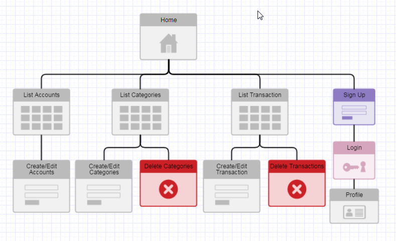

# wdi-project-2 - FinHelp

#### [App Deployed on Heroku](https://finhelp.herokuapp.com/)

## Overview

FinHelp is a simple web application for tracking expense and income transactions.  

Following functionalities are currently supported (on top of user creation and authentication):

1. Create, edit and delete of categories and sub-categories to group the transactions
2. Create and edit of accounts (savings, credit card) in which transactions will be saveUninitialized
3. Create, edit and delete of transactions
4. View outstanding balances of each account and overall

## Use Case Diagram

## ER Diagram

## Site Map

## Built With
1. Express for Node.js
2. Bootstrap
  * Modals
3. Mongoose for MongoDB

## Development process

### Planning, Learning and Challenges

1. Mongoose API
2. Bootstrap UI
3. Testing frameworks: mocha-mongoose, chai (for db models)
4. Express - middlewares, routers, controllers and MVC structure

### TDD

1. Advantages
  - Mocha-mongoose
  - Catch potential errors earlier
  - Independent of view
2. Pain Points
  - Time
  - MongoDB Testing

### Needs Improvement

1. DB Modeling
2. DB/Mongoose Queries
3. UI: Structure of View Components
4. Project Timeline
5. Key Functionalities-Reporting and Data Upload

___

*This project was created for WDI SG Course and inspired by YNAB, commercial budgeting tool.*
